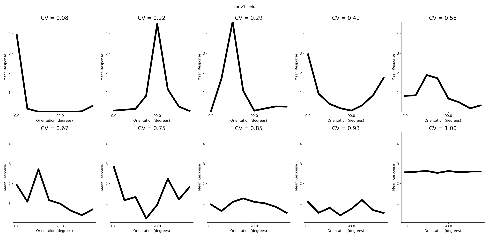
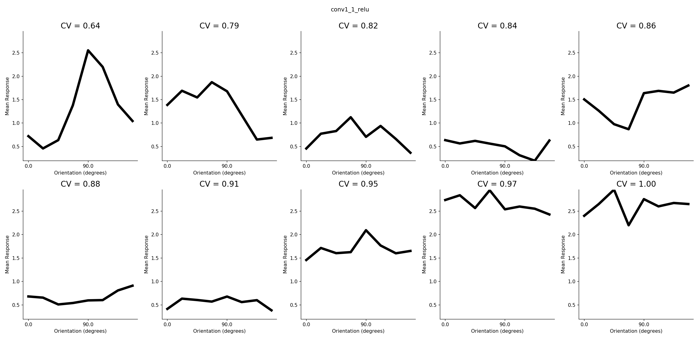
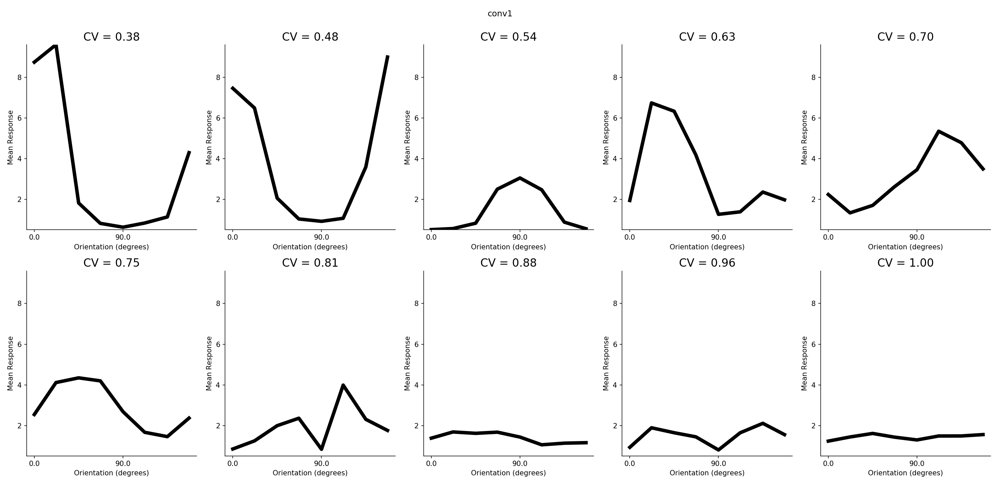
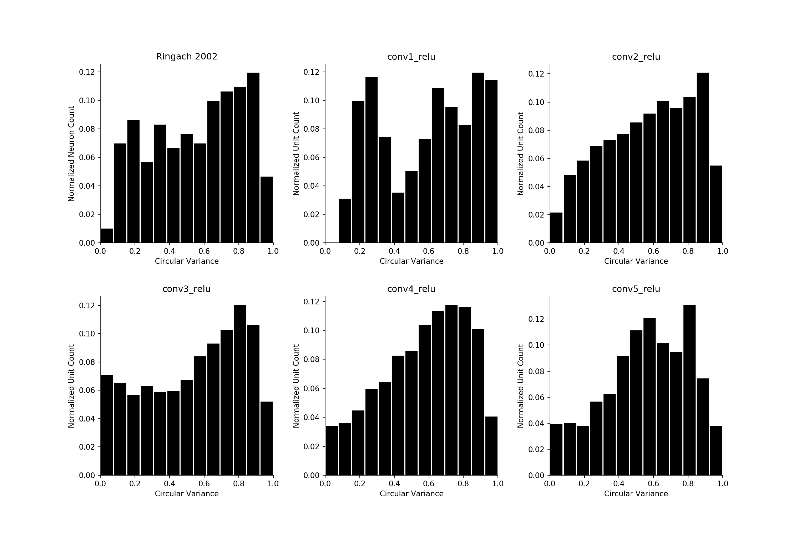
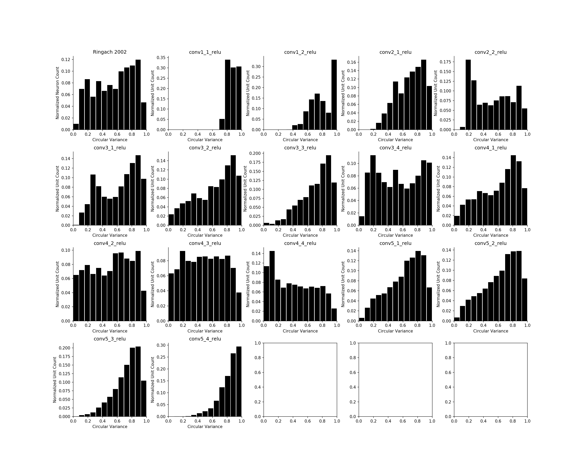
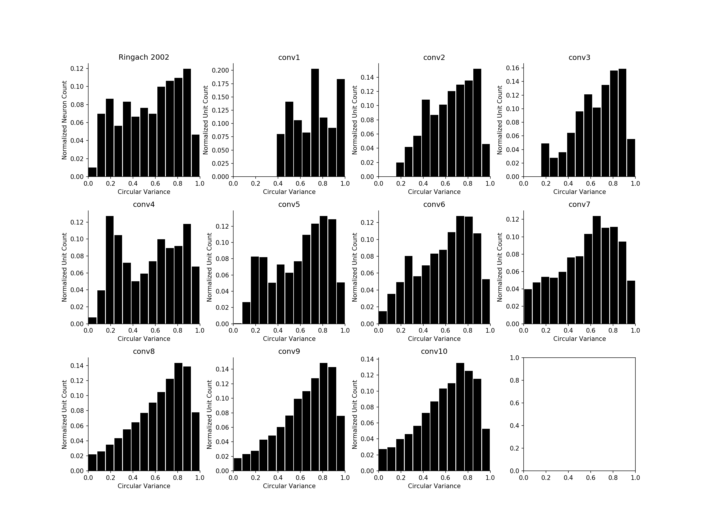
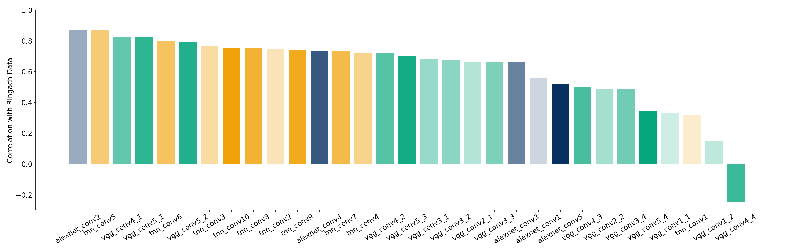

# PSYCH250 Final Project
## Identifying a V1-like layer in Deep Convolutional Neural Networks
#### Eshed Margalit

## Installation
Requirements:
```
python 2.7+
GPU with CUDA libraries installed to support tensorflow
```

Install the TNN library:
```bash
git clone https://github.com/neuroailab/tnn.git
cd tnn
pip install .
```

Install tfutils:
```bash
pip install git+https://github.com/neuroailab/tfutils.git
```

Install the p250 project:
```
git clone https://github.com/eshedmargalit/p250.git
cd p250
python setup.py install
```

## Using the scripts
Because this project is based on pre-trained models, you need access to the appropriate model checkpoints. Due to their size, they are not uploaded here. Similarly, `.tfrecord` files with test set stimuli are not uploaded. Please contact Eshed for access.
You'll need to set the `PROJ_PATH` to tell the scripts where to look for inputs and where to output figures. 
```bash
export PROJ_PATH="/mnt/fs6/eshedm"
```
Note the lack of trailing forward-slash, the scripts append that for you.

#### `scripts/01_get_features/extract_features.py`
Used to save an HDF5 file with model features. Example use case:
`python extract-features.py --gpu 1 --exp_id vgg19_slim --config_name sineff_20190507`

#### `scripts/02_compute_tuning_curves.py`
Given the outputs of the previous script, computes tuning curves for orientation, spatial frequency, color, and phase of a drifting Gabor test set.

#### `scripts/03_circular_variance.py`
Given the tuning curves, computes circular variance for orientation tuning and compares the distribution of each model layer to published data from Ringach et al., 2002

## Results
In this work, three architectures were compared:
1. Alexnet
2. VGG19
3. TNN10, a 10-layer convolutional architecture

Each model was trained on ImageNet, then evaluated on a set of sine gratings at different orientations, spatial frequencies, phases, and colors. For this analysis, tuning curves with respect to orientation were computed. From each tuning curve, a measure of sharpness, `circular variance` can be computed. Lower circular variances correspond to sharper tuning curves. 

### Example Tuning Curves for Each Model
##### Alexnet: conv1


##### VGG: conv1_1


##### TNN: conv1


### Circular Variance Histograms
Instead of looking at tuning curves for single units for a single layer, we can create histograms of all circular variance values for all units in all layers, then compare to the published macaque V1 data:

##### Alexnet


##### VGG


##### TNN


### Final Comparison
Finally, we can correlate each layer histogram to the true data to identify our V1 candidate. In this plot, different colors index different models, and different hues go from early in the model (light colors) to later in the model (dark colors):


## Conclusions
TODO
